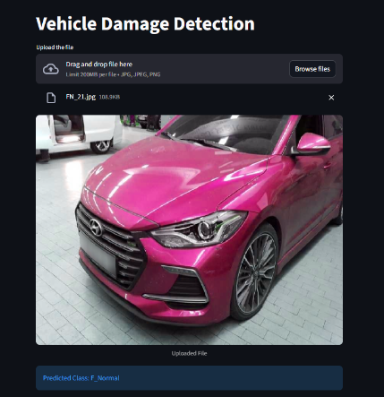

🚗 Vehicle Damage Detection App
An AI-powered web application that detects and classifies vehicle damage using Deep Learning and Transfer Learning techniques.
This application allows users to upload a locally stored image of a vehicle, and the model predicts the type of damage present in the car image through an interactive Streamlit interface.

✨ Features
Upload car images through an easy-to-use web interface
Predict vehicle damage in real time using AI
Built using Deep Learning and Transfer Learning techniques
Supports multiple front and rear damage categories
Lightweight and user-friendly Streamlit application
Quick and efficient image classification system

📷 How It Works
Download or capture a vehicle image
Upload the image through the application
The AI model analyzes the image
The predicted damage category is displayed instantly

📷 Application Demo

Prediction Result
The model analyzes the image and predicts the damage category instantly.

Example Output:
Predicted Class: Front Normal

🧠 Model Overview
This project uses ResNet50 with Transfer Learning for vehicle damage classification.

📌 Supported Classes
Front Normal
Front Crushed
Front Breakage
Rear Normal
Rear Crushed
Rear Breakage

📊 Training Details
Dataset Size: ~1700 images
Model Used: ResNet50
Framework: PyTorch
Validation Accuracy: ~76%
Image-based classification approach

The model was mainly trained on third-quarter front and rear-side vehicle images to improve damage recognition performance.

ech Stack
Python
PyTorch
Streamlit
torchvision
PIL

📷 Application Preview
Upload Vehicle Image

Users can upload .jpg, .jpeg, or .png images directly through the web interface.

Prediction Output

The model analyzes the image and predicts the damage category instantly.

Example Prediction:
Predicted Class: Front Normal

⚙️ Installation

Clone the repository:

git clone <your-repository-link>
cd vehicle-damage-detection

Install dependencies:
pip install -r requirements.txt

Run the application:
streamlit run app.py

📁 Project Structure
vehicle-damage-detection/
│
├── app.py
├── model_helper.py
├── requirements.txt
├── saved_model/
├── images/
└── README.md

